# Phishing Detection Lab — GoPhish + Mailhog + Splunk

A cybersecurity home lab simulating a real-world phishing attack and SOC detection workflow using GoPhish, Mailhog, and Splunk. Built on Kali Linux 2026.1 as a portfolio project demonstrating phishing simulation, log ingestion, and threat detection.

---

## What This Lab Demonstrates

- Simulating a phishing campaign using GoPhish against a safe local mail server
- Capturing the full phishing kill chain: Email Sent → Opened → Link Clicked → Credentials Submitted
- Forwarding attack events into Splunk via HTTP Event Collector (HEC)
- Writing SPL detection queries to identify phishing activity
- Building a live SOC-style dashboard in Splunk
- Accessing the dashboard remotely via Tailscale (including mobile)

---

## MITRE ATT&CK Techniques Covered

| Technique | ID | Description |
|---|---|---|
| Spearphishing Link | T1566.002 | Phishing email with malicious link sent to victim |
| Credentials from Web Browser | T1555.003 | Fake login page capturing submitted credentials |
| User Execution | T1204 | Victim clicks link and interacts with payload |

---

## Tools Used

| Tool | Purpose | Cost |
|---|---|---|
| GoPhish | Phishing simulation framework | Free / Open Source |
| Mailhog | Local fake SMTP server — emails never leave the machine | Free / Open Source |
| Splunk Enterprise | SIEM for log ingestion, detection, and dashboards | Free (500MB/day) |
| Python 3 | Script to forward GoPhish events to Splunk HEC | Free |
| Tailscale | Secure remote access to Splunk dashboard from anywhere | Free |

---

## Architecture

```
GoPhish Campaign
      │
      ▼
Mailhog (SMTP :1025)     ← catches all emails locally, nothing sent to internet
      │
      ▼
GoPhish REST API (:3333)
      │
      ▼
Python Forwarding Script  ← polls GoPhish every 60 seconds
      │
      ▼
Splunk HEC (:8088)
      │
      ▼
Splunk Dashboard (:8000)  ← accessible remotely via Tailscale
```

---

## Lab Setup — Step by Step

### Prerequisites

- Kali Linux 2026.1 (rolling)
- Python 3 installed (included in Kali)
- At least 4GB free disk space for Splunk

---

### Phase 1 — Mailhog (Local SMTP Server)

Mailhog catches all outgoing emails locally so nothing ever reaches the real internet.

```bash
# Download Mailhog binary
wget https://github.com/mailhog/MailHog/releases/download/v1.0.1/MailHog_linux_amd64

# Make it executable
chmod +x MailHog_linux_amd64

# Run it
./MailHog_linux_amd64
```

Mailhog binds to two ports:
- **SMTP:** `localhost:1025` — GoPhish sends emails here
- **Web UI:** `localhost:8025` — view captured emails in browser

Verify it works by opening `http://localhost:8025` in Firefox. You should see the Mailhog inbox.

---

### Phase 2 — GoPhish (Phishing Simulation)

```bash
# Download GoPhish
wget https://github.com/gophish/gophish/releases/download/v0.12.1/gophish-v0.12.1-linux-64bit.zip

# Unzip it
unzip gophish-v0.12.1-linux-64bit.zip -d gophish
cd gophish

# Make executable and run
chmod +x gophish
sudo ./gophish
```

On first run, GoPhish prints your admin credentials in the terminal:
```
Please login with the username admin and the password [RANDOM_PASSWORD]
```
Save that password, then open `https://localhost:3333` in Firefox. Accept the SSL warning (Advanced → Accept the Risk) and log in.

#### Configure Sending Profile (GoPhish → Mailhog)

In GoPhish go to **Sending Profiles → New Profile:**

```
Name:     Lab SMTP - Mailhog
From:     attacker@fake-corp.com
Host:     localhost:1025
Username: (leave blank)
Password: (leave blank)
```

> **Note:** In newer versions of GoPhish the port is entered directly in the Host field as `localhost:1025` — there is no separate port field.

Click **Send Test Email** → check `http://localhost:8025` to confirm the email arrives in Mailhog.

#### Create Email Template

Go to **Email Templates → New Template:**

```
Name:    IT Password Reset Phish
Subject: [URGENT] Your password expires in 24 hours
```

HTML body:
```html
<html>
<body>
<p>Dear {{.FirstName}},</p>
<p>Our IT security system has detected that your account password is expiring in <strong>24 hours</strong>.</p>
<p>To avoid losing access, reset your password immediately:</p>
<p><a href="{{.URL}}">Click here to reset your password</a></p>
<p>If you do not reset your password, your account will be locked at midnight tonight.</p>
<p>Regards,<br>IT Security Team<br>Acme Corporation</p>
</body>
</html>
```

Check **Add Tracking Image** to detect email opens.

#### Create Landing Page

Go to **Landing Pages → New Page:**

```
Name: Fake IT Login Page
```

HTML:
```html
<html>
<head>
  <title>Acme Corp - Secure Login</title>
  <style>
    body { font-family: Arial, sans-serif; background: #f2f2f2; display: flex; justify-content: center; align-items: center; height: 100vh; margin: 0; }
    .box { background: white; padding: 40px; border-radius: 8px; width: 320px; box-shadow: 0 2px 10px rgba(0,0,0,0.1); }
    h2 { text-align: center; color: #333; }
    input { width: 100%; padding: 10px; margin: 8px 0; box-sizing: border-box; border: 1px solid #ccc; border-radius: 4px; }
    button { width: 100%; padding: 10px; background: #0057b8; color: white; border: none; border-radius: 4px; cursor: pointer; font-size: 15px; }
    p { text-align: center; font-size: 12px; color: #888; }
  </style>
</head>
<body>
  <div class="box">
    <h2>Acme Corp IT Portal</h2>
    <p>Your session has expired. Please log in again.</p>
    <form method="POST">
      <input type="text" name="username" placeholder="Username" required/>
      <input type="password" name="password" placeholder="Password" required/>
      <button type="submit">Login</button>
    </form>
    <p>Having trouble? Contact IT at support@acme-corp.com</p>
  </div>
</body>
</html>
```

Enable both:
- Capture Submitted Data
- Capture Passwords

#### Create Target Group

Go to **Users & Groups → New Group:**

```
Group Name: Lab Victims
First Name: John
Last Name:  Smith
Email:      john.smith@acme-corp.com
Position:   Employee
```

#### Launch Campaign

Go to **Campaigns → New Campaign:**

```
Name:             Lab Phishing Campaign 1
Email Template:   IT Password Reset Phish
Landing Page:     Fake IT Login Page
URL:              http://localhost
Sending Profile:  Lab SMTP - Mailhog
Groups:           Lab Victims
```

Click **Launch Campaign.** The full kill chain will be tracked in real time: `Email Sent → Email Opened → Clicked Link → Submitted Data`

---

### Phase 3 — Splunk (Detection & Dashboard)

#### Install Splunk on Kali Linux 2026.1

> **Important:** Older versions of Splunk (pre-9.3) fail on Kali 2026.1 due to an OpenSSL 3 incompatibility. Use version 9.3.2 or later.

```bash
# Download Splunk 9.3.2 (compatible with Kali 2026.1 / OpenSSL 3)
wget -O splunk.deb "https://download.splunk.com/products/splunk/releases/9.3.2/linux/splunk-9.3.2-d8bb32809498-linux-2.6-amd64.deb"

# Install
sudo dpkg -i splunk.deb

# Start Splunk and accept license
sudo /opt/splunk/bin/splunk start --accept-license
```

Create your admin username and password when prompted. Then open `http://localhost:8000` in Firefox.

#### Enable HTTP Event Collector (HEC)

1. Go to **Settings → Data Inputs → HTTP Event Collector**
2. Click **Global Settings** → set All Tokens to **Enabled** → disable SSL → port `8088` → Save
3. Click **New Token:** Name: `gophish-hec` | Source Type: `_json` | Index: `main`
4. Click **Review → Submit** and copy the token shown

#### Forward GoPhish Events to Splunk

Get your GoPhish API key from **Account Settings** in the GoPhish admin panel. Save this script as `~/lab/gophish_to_splunk.py`:

```python
import requests
import time
import json

GOPHISH_API = "https://localhost:3333/api"
GOPHISH_KEY = "YOUR_GOPHISH_API_KEY"
SPLUNK_HEC  = "http://localhost:8088/services/collector/event"
SPLUNK_TOK  = "YOUR_HEC_TOKEN"

def forward_events():
    campaigns = requests.get(
        f"{GOPHISH_API}/campaigns/",
        headers={"Authorization": f"Bearer {GOPHISH_KEY}"},
        verify=False
    ).json()

    for campaign in campaigns:
        for event in campaign.get("timeline", []):
            payload = {
                "event": event,
                "sourcetype": "_json",
                "source": "gophish",
                "index": "main"
            }
            requests.post(
                SPLUNK_HEC,
                json=payload,
                headers={"Authorization": f"Splunk {SPLUNK_TOK}"},
                verify=False
            )
            print(f"Forwarded event: {event.get('message')}")

while True:
    print("Polling GoPhish...")
    forward_events()
    time.sleep(60)
```

Replace `YOUR_GOPHISH_API_KEY` and `YOUR_HEC_TOKEN` with your actual values, then run:

```bash
python3 ~/lab/gophish_to_splunk.py
```

#### Detection Searches (SPL)

Verify events are flowing into Splunk:
```
index=main source=gophish
```

**Detection 1 — Credential Submissions:**
```
index=main source=gophish message="Submitted Data"
| table _time, email, details
| sort -_time
```

**Detection 2 — Link Clicks:**
```
index=main source=gophish message="Clicked Link"
| table _time, email, details
| sort -_time
```

**Detection 3 — Full Kill Chain Summary:**
```
index=main source=gophish
| stats count by message
| rename message as Event_Type, count as Total
```

Save each as a **Report** in Splunk for your dashboard.

#### Build the Dashboard

Go to **Dashboards → Create New Dashboard:** Title: `Phishing Campaign Monitor` | Description: `GoPhish phishing simulation detections` | Type: `Classic Dashboard`. Add these panels: Bar Chart — Kill Chain Summary (Detection 3 query), Pie Chart — Event Type Breakdown (Detection 3 query), Statistics Table — Captured Credentials (Detection 1 query), Statistics Table — Link Click Events (Detection 2 query).

---

### Phase 4 — Remote Access via Tailscale (Optional)

Tailscale lets you access your Splunk dashboard from anywhere — including your phone — without exposing it to the public internet.

```bash
curl -fsSL https://tailscale.com/install.sh | sh
sudo tailscale up
```

A login URL will appear in the terminal. Open it and sign in or create a free Tailscale account. Get your Tailscale IP:

```bash
tailscale ip -4
```

Install the Tailscale app (App Store / Google Play), sign in with the same account, and open `http://[YOUR-TAILSCALE-IP]:8000` in your browser.

> **Tip:** In Safari, tap **Share → Add to Home Screen** to create a shortcut that opens like an app.

---

## Startup Order (After Reboot)

Always start services in this order:

```bash
# Terminal 1 — Mailhog
./MailHog_linux_amd64

# Terminal 2 — GoPhish
cd ~/gophish && sudo ./gophish

# Terminal 3 — Splunk
sudo /opt/splunk/bin/splunk start

# Terminal 4 — Forwarding script
python3 ~/lab/gophish_to_splunk.py
```

---

## Repository Structure

```
splunk-phishing-lab/
├── README.md
├── gophish/
│   └── campaign-config-example.json
├── splunk/
│   ├── searches/
│   │   ├── detect-credential-submissions.spl
│   │   ├── detect-link-clicks.spl
│   │   └── kill-chain-summary.spl
│   └── dashboards/
│       └── phishing-campaign-monitor.xml
├── scripts/
│   └── gophish_to_splunk.py
└── screenshots/
    ├── 01-mailhog-terminal.png
    ├── 02-gophish-dashboard.png
    ├── 03-sending-profile-verified.png
    ├── 04-mailhog-test-email.png
    ├── 05-mailhog-phishing-inbox.png
    ├── 06-campaign-launched.png
    ├── 07-campaign-kill-chain.png
    ├── 08-splunk-events.png
    ├── 09-splunk-detections.png
    ├── 10-splunk-dashboard.png
    └── 11-mobile-dashboard.png
```

---

## Screenshots

### 1. Mailhog Terminal
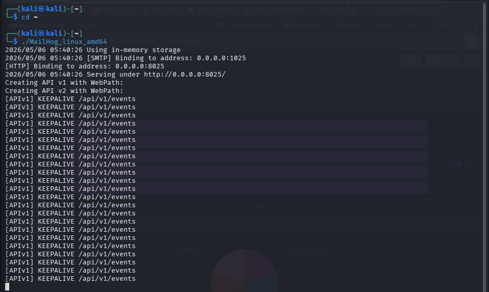

### 2. GoPhish Dashboard
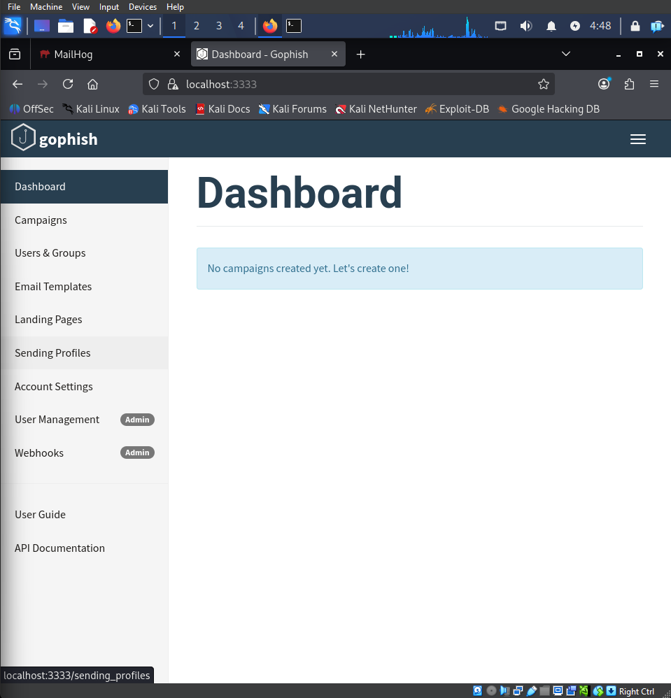

### 3. Sending Profile Verified
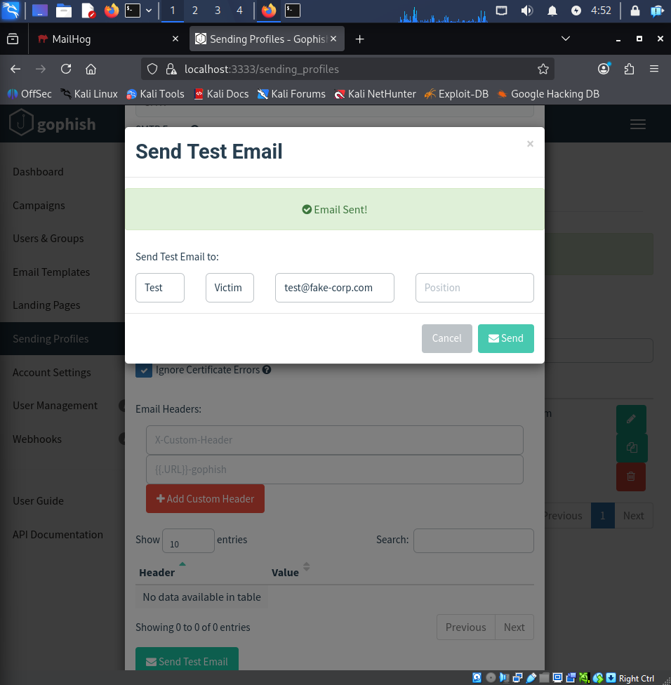

### 4. Mailhog Test Email
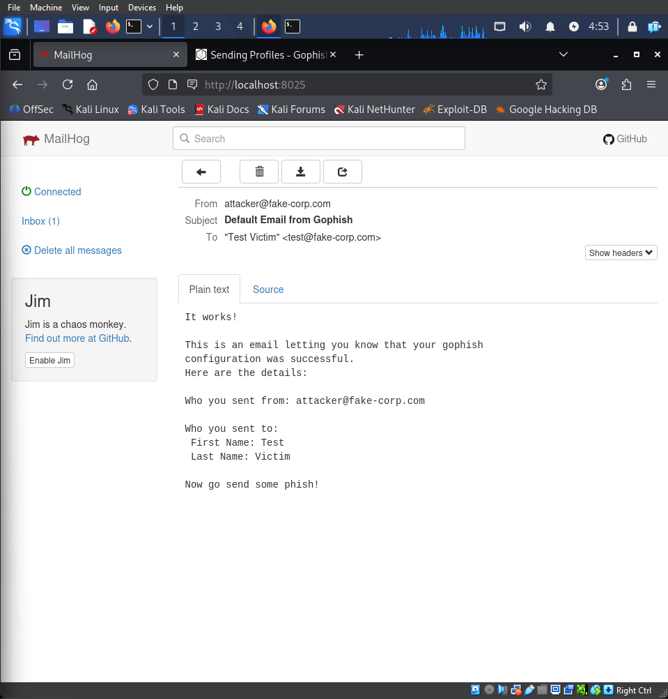

### 5. Mailhog Phishing Inbox
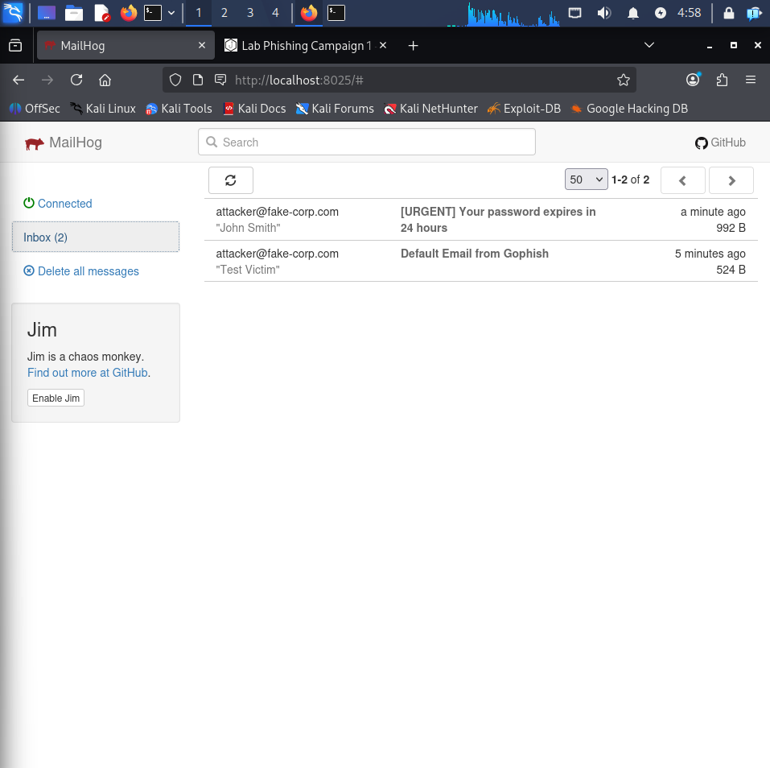

### 6. Campaign Launched
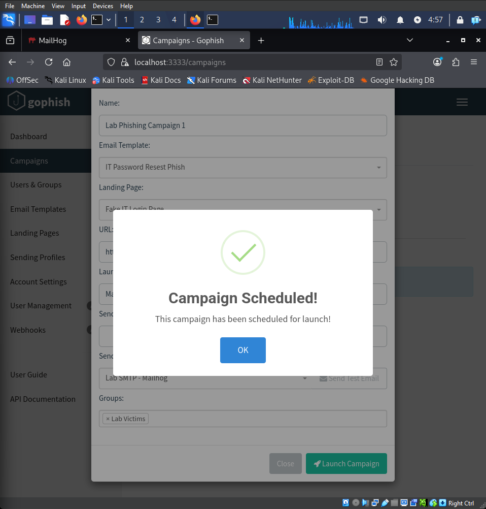

### 7. Campaign Kill Chain
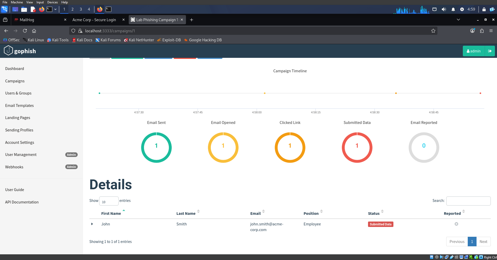

### 8. Splunk Events
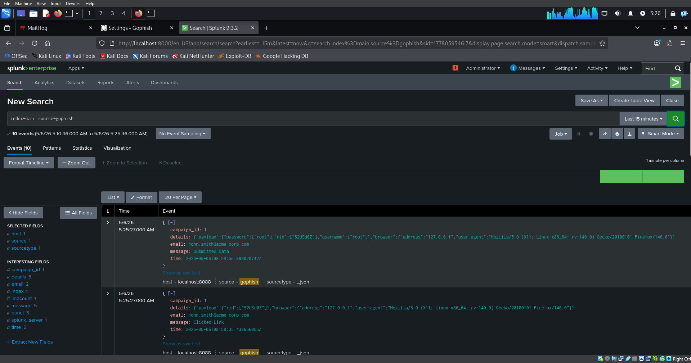

### 9. Splunk Detections
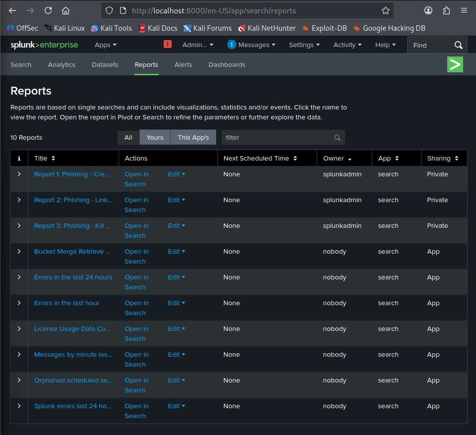

### 10. Splunk Dashboard
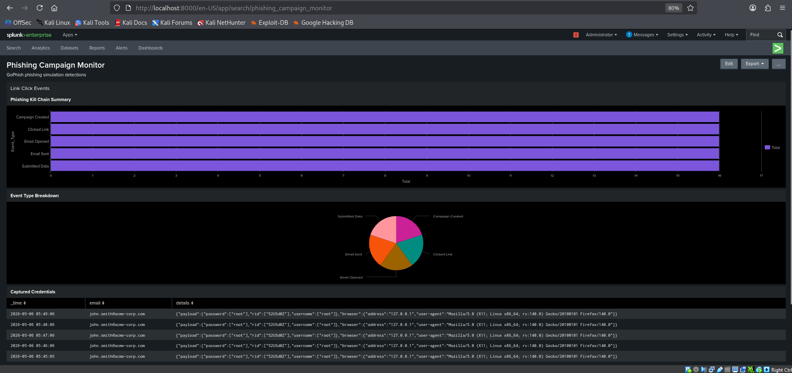

### 11. Mobile Access via Tailscale
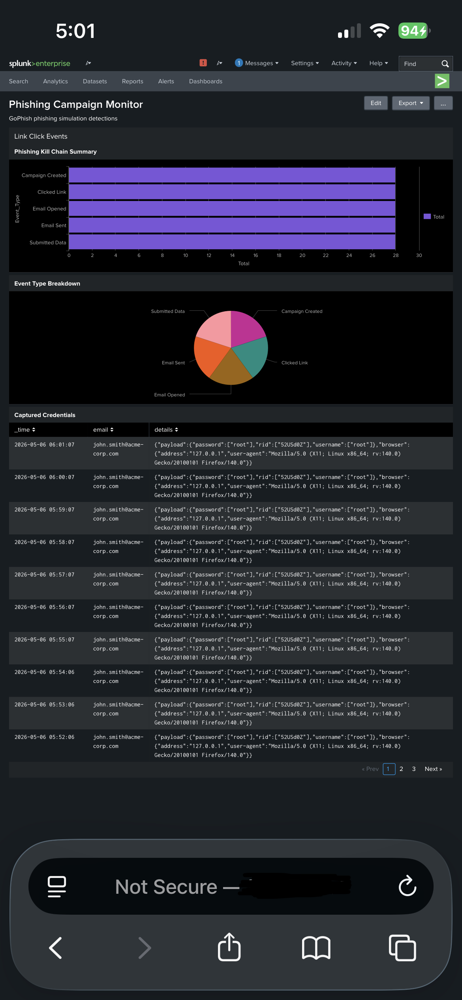

---

## Lessons Learned

- **Kali 2026.1 compatibility:** Splunk versions older than 9.3 fail due to an OpenSSL 3 conflict. Always use Splunk 9.3.2+ on modern Kali.
- **GoPhish port field:** Newer GoPhish versions combine host and port into one field (`localhost:1025`) rather than separate fields.
- **False positive tuning:** In a real SOC environment these detections would need tuning — for example filtering out known security team IP addresses running phishing simulations.
- **Operational security:** In a real engagement, the From address would be spoofed to mimic a trusted domain. Email gateways with SPF/DKIM/DMARC validation would catch many of these.
- **Real world additions:** A production version of this lab would add Sysmon endpoint telemetry, email gateway logs, and integrate with a SOAR platform for automated response.

---

## Disclaimer

This lab is built entirely on localhost using a fake SMTP server (Mailhog). No real emails are sent. All campaigns target fake email addresses in a controlled environment. This project is for educational purposes only.

---

## Author

Built as a cybersecurity portfolio project demonstrating SOC analyst skills including phishing simulation, SIEM log ingestion, SPL query writing, and dashboard development.

Author
Built as a cybersecurity portfolio project demonstrating SOC analyst skills including phishing simulation, SIEM log ingestion, SPL query writing, and dashboard development.
